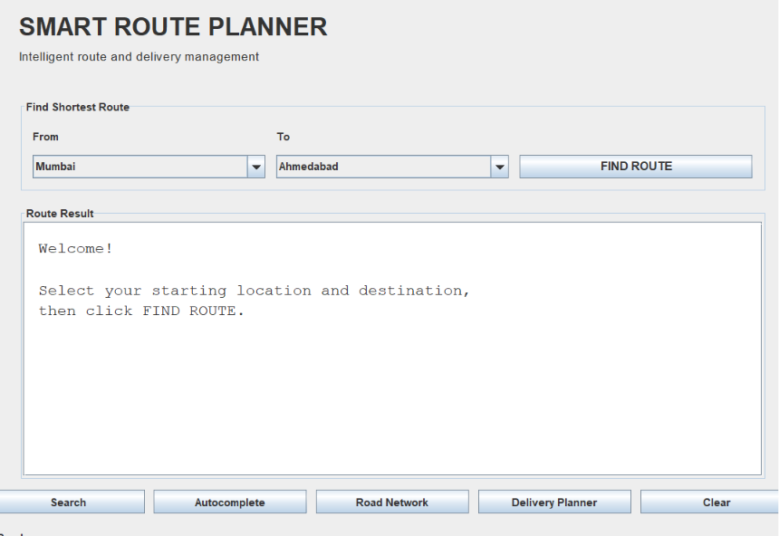
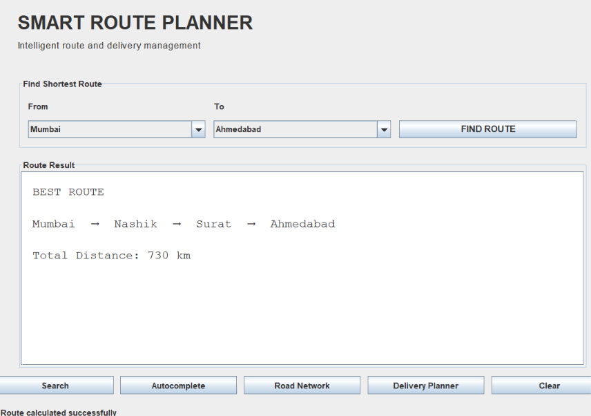
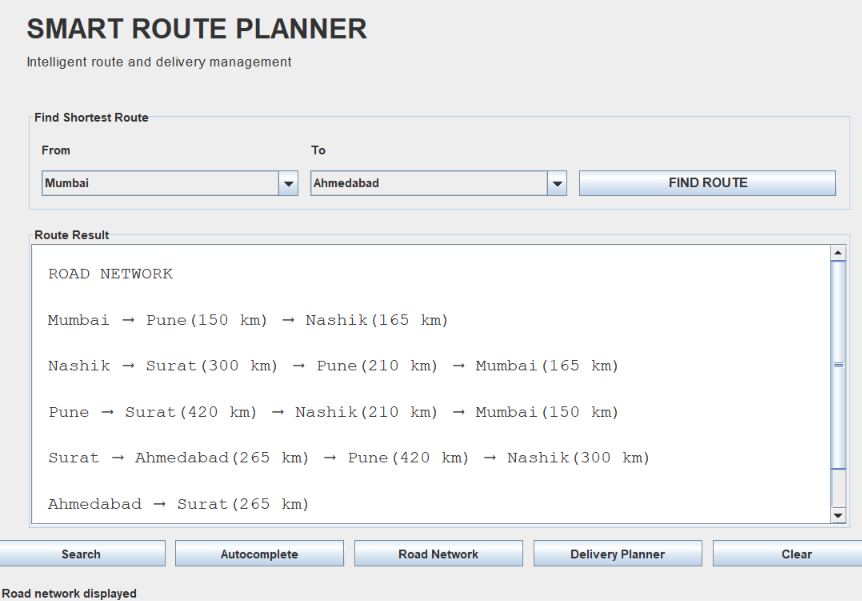
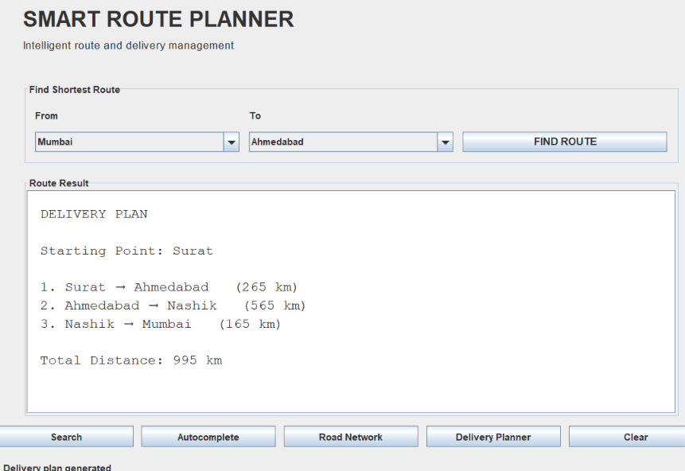

# 🚚 Smart Route & Delivery Planner

A Java-based desktop application that applies **Data Structures and Algorithms (DSA)** to solve real-world route planning and delivery problems.

The application represents locations as a graph and provides features such as shortest route calculation, graph traversal, location searching, road network analysis, and delivery planning through a user-friendly **Java Swing GUI**.

---

## 📌 Project Overview

The **Smart Route & Delivery Planner** is designed to demonstrate how DSA concepts can be used in a practical route and delivery management system.

The application contains a predefined road network consisting of multiple locations connected by roads with different distances.

Users can select locations, find the shortest route between them, search for locations, view the road network, and generate a delivery plan.

The project focuses on applying DSA concepts rather than relying on Java's built-in collection framework for the main algorithmic components.

---

## ✨ Features

- 🗺️ Location and road network management
- 📍 Shortest route calculation
- 🔎 Location search
- 💡 Location autocomplete
- 🌐 Road network analysis
- 🔄 BFS graph traversal
- 🔁 DFS graph traversal
- 🧩 Connected Components detection
- 🔄 Cycle Detection
- 🚚 Delivery planning
- ⚡ Custom Min Heap for efficient shortest-path processing
- 🖥️ Java Swing graphical user interface
- 📦 Windows desktop application packaging

---

## 🧠 Data Structures & Algorithms Used

### Graph

The road network is represented using a **Graph** with an adjacency list.

Each location is treated as a vertex, while each road connecting two locations is represented as an edge with a distance.

### BFS

**Breadth-First Search (BFS)** is used for graph traversal and exploring connected locations level by level.

### DFS

**Depth-First Search (DFS)** is used to explore the graph by going as deep as possible before backtracking.

### Connected Components

Connected Components are used to determine separate groups of locations that are connected to each other within the road network.

### Cycle Detection

Cycle Detection is used to identify whether the road network contains circular paths.

### Dijkstra's Algorithm

**Dijkstra's Algorithm** is used to calculate the shortest distance between two locations when roads have different distances.

The application also keeps track of previous locations so that the complete shortest route can be reconstructed and displayed instead of showing only the final distance.

### Trie

A **Trie** data structure is used for location searching and prefix-based suggestions.

This allows the application to provide location suggestions while the user searches.

### Min Heap

A custom **Min Heap** is used by Dijkstra's Algorithm to efficiently select the location with the smallest current distance.

### Greedy Strategy

The **Delivery Planner** uses a simple greedy strategy to create a practical sequence of delivery locations.

---

## 🛠️ Technologies Used

- **Java**
- **Java Swing**
- **Data Structures and Algorithms**
- **Graph**
- **Adjacency List**
- **Dijkstra's Algorithm**
- **BFS**
- **DFS**
- **Connected Components**
- **Cycle Detection**
- **Trie**
- **Min Heap**
- **Greedy Algorithm**
- **Java jpackage**

---

## 🖥️ Application Screenshots

### Main Application



### Shortest Route



### Road Network



### Delivery Planner



---

## ⚙️ How the Project Works

The application first creates a road network where locations are represented as vertices and roads are represented as weighted edges.

When the user selects a starting and destination location, Dijkstra's Algorithm calculates the minimum distance between them.

The application stores the previous location for each visited location, which allows it to reconstruct the actual shortest route.

BFS and DFS provide graph traversal functionality, while Connected Components and Cycle Detection help analyse the structure of the road network.

For location searching and prefix-based suggestions, the project uses a Trie data structure.

The Delivery Planner uses a greedy approach to generate a practical sequence of delivery locations.

All these DSA operations are connected to a Java Swing GUI, allowing the user to interact with the application without directly working with the underlying graph or algorithms.

---

## ▶️ How to Run

Make sure **Java JDK 21 or later** is installed on your system.

Open a terminal in the project folder and run:

```bash
javac RoutePlanner.java
java RoutePlanner
```

The Java Swing graphical interface will open automatically.

---

## 🚀 Future Scope

The project can be further improved by adding:

- Integration with real-time maps and GPS data
- Real-time traffic and road condition updates
- More advanced delivery route optimization
- Support for multiple delivery vehicles
- Database integration for storing locations, roads, and delivery data
- User accounts and delivery history
- Cloud-based deployment for remote access
- Mobile application support

---

## 👨‍💻 Author

**Sujal Patil**
